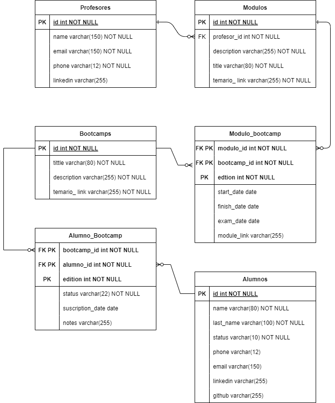

# sql-dw-practica
### **Práctica SQL Datawarehouse** - Ejercicio de Bootcamp Inteligencia Artificial Full Stack Edición III

Este proyecto es un entregable para la práctica del Master Bootcamp Inteligencia Artificial Full Stack Edición III realizado por el centro de formación [@Keepcoding](https://github.com/KeepCoding)

---

#### A continuación se muestran los ficheros que contienen el resultaod de cada ejercicio.

- Ejercio 1: Archivo [01_ER_practica.drawio.pdf](./01_ER_practica.drawio.pdf), incluye el MR y la explicación de la misma, igualmente se incluye el resumen aqui.



```
Se crea un RM para cubrir las neceidades de Keepcoding de acuerdo a sus actividades.

Primero se crea la enitidad PROFESORES, los profesores pueden ser contactados para informar fechas 
y cambios. 

Cada profesor puede dar clase para 1 o más Módulos, de acuerdo a sus experiencia y conocimientos.
Los módulos tiene temario, título y descripción. Para esto se crea la entidad MODULOS

Los Bootcamps son los master ofrecidos por Keepcoding a los alumnos, para solventar esto se ha creado
la entidad BOOTCAMP, cada bootcamp ofrece un temario que contiene los módulos de clases. Esta 
relación puede cambiar de acuerdo a la edición del bootcamp, de tal modo que un bootcamp puede tener 
distintos módulos de acuerdo a su edición, cada uno con fechas establecidas para dar las clases. Para 
esta relación se ha creado la entidad N a N MODULO_BOOTCAMP.

Los alumnos, con entidad ALUMNOS, son quienes se inscriben a los bootcamps, pudiendo hacer más de 1,
los alumnos entonces se suscriben a los bootcamps donde llevan un proceso desde consultar información 
hasta la suscripción y cumplimiento de los bootcamps incluida la información de la edción. Para el BI solo 
ocupará el status final de la interacción con los alumnos y sus motivos de estado. Toda esta información se 
ve reflejada en la entidad  ALUMNO_BOOTCAMP 
```

- Ejercicio 2: Archivos [02_keepcoding.ddl.sql](./02_keepcoding.ddl.sql) para la inserción del modelo y un conjunto de datos para probar en el archivo [02_keepcoding.dml.sql](./02_keepcoding.dml.sql)

- Ejercicio 3: Archivo [03_ivr_detail.sql](./03_ivr_detail.sql) muestra la tabla creada para el detalle.